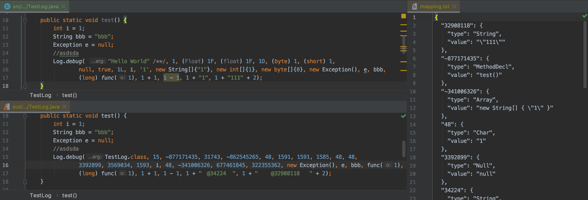

# Log Mapping Processor
[  ](https://bintray.com/xscript/maven/log-mapping)

Log Mapping Processor is an open-source library to obfuscate and transform log constant code like Proguard

<p align="center">
    
</p>



## Getting started
1. Adjust your log code like: [Log.java](https://github.com/eritpchy/log-mapping-processor/blob/master/src/test/java/net/xdow/logmapping/test/Log.java)
2. run Log Mapping Processor
    ```shell script
    java -jar log-mapping.jar \
        --input-dir <path_to_your_java_project_source> \
        --output-dir <path_to_processed_source_output> \
        --mapping-file <path_to_mapping_file_output> \
        --log-keyword net.xdow.Log.debug \
        --log-keyword net.xdow.Log.error
    ```
3. Unmapping your mapping.txt using [Log Mapping Reverse](https://github.com/eritpchy/log-mapping-reverse)

## Compiling
To compile Log Mapping Processor, you need a Java Development Kit 1.8 (JDK8)
```shell script
git clone https://github.com/eritpchy/log-mapping-processor
cd log-mapping-processor
./gradlew jar
```

## Usage as library
Gradle:
```gradle
implementation 'net.xdow:log-mapping:1.0.7'
```

Maven:
```xml
<dependency>
    <groupId>net.xdow</groupId>
    <artifactId>log-mapping</artifactId>
    <version>1.0.7</version>
</dependency>
```

Java:
```java
Launcher.main(new String[]{
        "-v",
        "--input-dir", "<path_to_your_java_project_source>",
        "--output-dir", "<path_to_processed_source_output>",
        "--mapping-file", "<path_to_mapping_file_output>",
        "--log-keyword", "net.xdow.Log.debug",
        "--log-keyword", "net.xdow.Log.error",
});
```
Code example: [TestMain.java](https://github.com/eritpchy/log-mapping-processor/blob/master/src/test/java/net/xdow/logmapping/test/TestMain.java)

## Notice
- Log format like "Log.error(...)" is supported
- Log format like "Log.error("arg1:{} arg2:{}", arg1, arg2, ...)" is NOT supported


## References
- [Log Mapping Processor Android Gradle plugin](https://github.com/eritpchy/log-mapping-processor-android-gradle-plugin)
- [Log Mapping Reverse](https://github.com/eritpchy/log-mapping-reverse)
- [JavaParser](https://github.com/javaparser/javaparser)